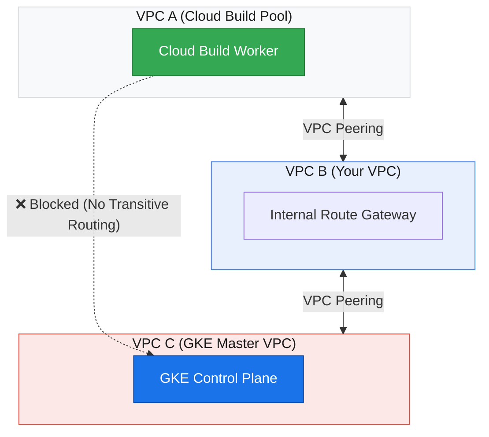
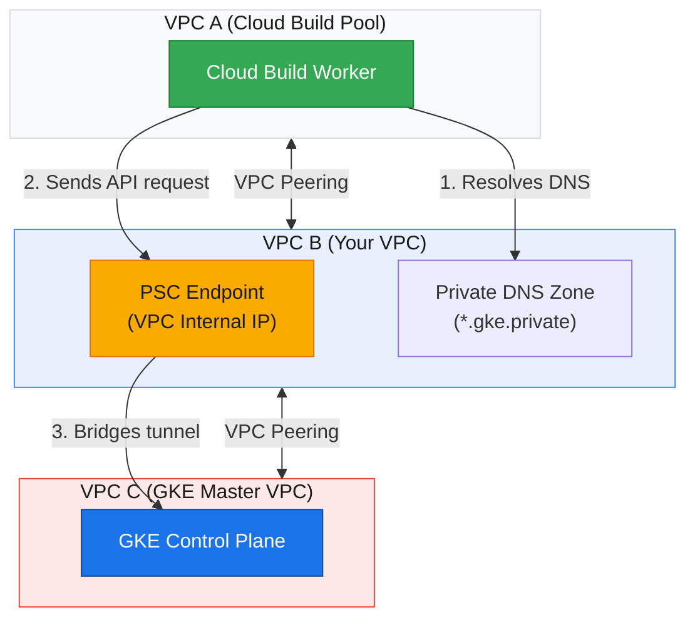

import Callout from '@/components/Callout.astro'

This guide documents the setup for a fully private GKE cluster that remains accessible to internal CI/CD pipelines without needing proxy VMs or complex VPN configurations.

### The Problem: Transitive VPC Peering
By default, VPC network peering in GCP is not transitive. If the VPC hosting your **Cloud Build Private Worker Pool (VPC A)** is peered with your **customer VPC (VPC B)**, and your customer VPC is peered with the **GKE Control Plane VPC (VPC C)**, Cloud Build cannot route traffic directly to the GKE Control Plane.



### The Solution: Private Service Connect (PSC) with GKE DNS Access
When enabling DNS access, GCP provisions a Private Service Connect (PSC) endpoint inside **VPC B** that exposes the GKE master API. The control plane generates a local DNS zone in your network so that any peered VPC (like **VPC A**) can resolve and communicate directly to the master via this endpoint.



<Callout variant="note" title="Private Worker Pool Requirement">
  Since Cloud Build runs in a separate Google-managed tenant network, deploying to a private GKE cluster requires a **Private Worker Pool** peered to your customer VPC. Standard (public) worker pools cannot route to internal PSC endpoints.
</Callout>

## 1. Provisioning the Private GKE Cluster

The following command creates an Autopilot cluster that is completely isolated from the public internet. It uses the `--enable-dns-access` flag to create a local DNS endpoint within the VPC.

```bash
gcloud beta container clusters create-auto "autopilot-cluster" \
    --project "sidekick-1024" \
    --region "us-central1" \
    --release-channel "regular" \
    --enable-private-nodes \
    --enable-dns-access \
    --no-enable-ip-access \
    --no-enable-google-cloud-access \
    --network "default" \
    --subnetwork "default" \
    --cluster-ipv4-cidr "/17" \
    --binauthz-evaluation-mode=DISABLED
```

### Key Networking Flags:

* **`--enable-dns-access`**: Enables the DNS-based control plane (PSC), allowing the cluster to be reached via a local VPC IP.
* **`--no-enable-ip-access`**: Disables the public IP endpoint for the control plane.
* **`--no-enable-google-cloud-access`**: Ensures only traffic originating from within your specific VPC (like a Private Worker Pool) can reach the master.

---

## 2. Application Source Code

A basic Python Flask application used for the Proof of Concept (POC).

### `app.py`

```python
from flask import Flask
import os

app = Flask(__name__)

@app.route('/')
def hello():
    version = os.environ.get('VERSION', 'v1.0')
    return f"Hello from Private GKE! (Version: {version})\nDeployed via Cloud Build DNS Endpoint."

if __name__ == '__main__':
    app.run(host='0.0.0.0', port=8080)
```

### `Dockerfile`

```dockerfile
FROM python:3.9-slim
WORKDIR /app
COPY requirements.txt .
RUN pip install --no-cache-dir -r requirements.txt
COPY . .
EXPOSE 8080
CMD ["python", "app.py"]
```

---

## 3. Kubernetes Manifests

Stored in `k8s/app.yaml`. Note the `PYTHON_IMAGE_PLACEHOLDER` which is dynamically replaced by the pipeline.

```yaml
apiVersion: apps/v1
kind: Deployment
metadata:
  name: python-poc-deployment
spec:
  replicas: 2
  selector:
    matchLabels:
      app: python-poc
  template:
    metadata:
      labels:
        app: python-poc
    spec:
      containers:
      - name: python-poc-container
        image: PYTHON_IMAGE_PLACEHOLDER
        ports:
        - containerPort: 8080
---
apiVersion: v1
kind: Service
metadata:
  name: python-poc-service
spec:
  type: LoadBalancer
  selector:
    app: python-poc
  ports:
  - port: 80
    targetPort: 8080
```

---

## 4. CI/CD Pipeline Configuration

The `cloudbuild.yaml` file is configured to run on a **Private Worker Pool**. It combines authentication and deployment into a single step to maintain the container's credential context.

```yaml
steps:
  # 1. Build the Docker image
  - name: 'gcr.io/cloud-builders/docker'
    id: build
    args:
      - build
      - -t
      - '$_REGION-docker.pkg.dev/$PROJECT_ID/$_REPO_NAME/python-poc:$SHORT_SHA'
      - -t
      - '$_REGION-docker.pkg.dev/$PROJECT_ID/$_REPO_NAME/python-poc:latest'
      - .

  # 2. Push to Artifact Registry
  - name: 'gcr.io/cloud-builders/docker'
    id: push
    args:
      - push
      - --all-tags
      - '$_REGION-docker.pkg.dev/$PROJECT_ID/$_REPO_NAME/python-poc'
    waitFor: [build]

  # 3. Auth & Deploy (Combined Step to share ~/.kube/config)
  - name: 'gcr.io/google.com/cloudsdktool/cloud-sdk'
    id: deploy
    entrypoint: 'bash'
    args:
      - '-c'
      - |
        # Fetch credentials using the DNS endpoint (PSC)
        gcloud container clusters get-credentials $_CLUSTER_NAME \
          --region $_REGION \
          --dns-endpoint
        
        # Inject the unique image tag into the manifest
        sed -i "s|PYTHON_IMAGE_PLACEHOLDER|$_REGION-docker.pkg.dev/$PROJECT_ID/$_REPO_NAME/python-poc:$SHORT_SHA|g" k8s/app.yaml
        
        # Apply the update
        kubectl apply -f k8s/app.yaml
    waitFor: [push]

images:
  - '$_REGION-docker.pkg.dev/$PROJECT_ID/$_REPO_NAME/python-poc:$SHORT_SHA'
  - '$_REGION-docker.pkg.dev/$PROJECT_ID/$_REPO_NAME/python-poc:latest'

options:
  pool:
    name: 'projects/$PROJECT_ID/locations/$_REGION/privatePools/$_PRIVATE_POOL_NAME'

substitutions:
  _REGION: us-central1
  _REPO_NAME: poc-repo
  _CLUSTER_NAME: autopilot-cluster
  _PRIVATE_POOL_NAME: worker-pool
```

---

## 5. Deployment Pre-requisites

<Callout variant="important" title="Pre-requisites">
  Before triggering the pipeline, ensure the following IAM roles and network paths are established:
</Callout>

### IAM Roles for Cloud Build Service Account
Grant these roles to the Cloud Build Service Account (`[PROJECT_NUMBER]@cloudbuild.gserviceaccount.com`):
* **Artifact Registry Writer** (`roles/artifactregistry.writer`): Required to push Docker images.
* **Kubernetes Engine Developer** (`roles/container.developer`): Required to fetch cluster credentials and apply configurations.

### Networking Configuration
1. **Cloud Build Private Pool**: Must be peered with the customer VPC network.
2. **GKE Cluster Configuration**: The cluster must be launched with `--enable-dns-access` enabled to bypass transitive peering blocks.

