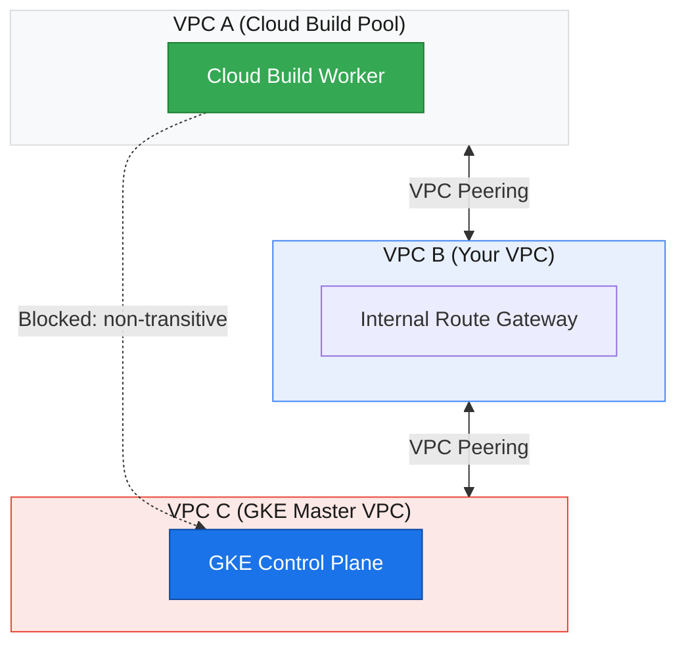
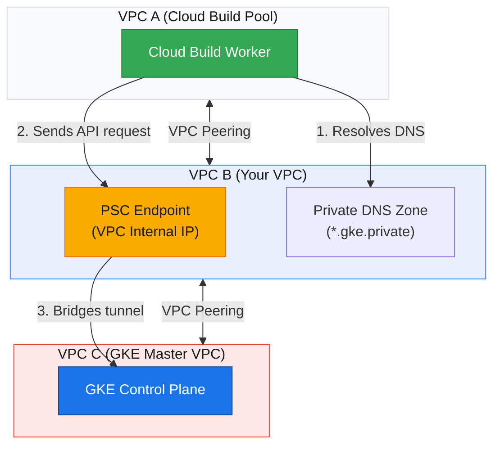

import Callout from '@/components/Callout.astro'

Deploying to a private GKE cluster from an internal CI/CD pipeline usually requires proxy VMs, bastion hosts, or complex VPN routing. Cloud Build DNS endpoints eliminate that overhead by letting workers reach the private control plane directly over Private Service Connect.

### The transitive VPC peering problem

VPC network peering in GCP is not transitive. If the VPC hosting your Cloud Build private worker pool (VPC A) peers with your application VPC (VPC B), and your application VPC peers with the GKE control plane VPC (VPC C), Cloud Build cannot route traffic directly to the GKE control plane.



### Private Service Connect with GKE DNS access

Enabling DNS access creates a Private Service Connect (PSC) endpoint inside VPC B that exposes the GKE control plane API. GKE creates a private Cloud DNS zone in your network so any peered network, including VPC A, can resolve the control plane endpoint and send requests directly to it.



<Callout variant="note" title="Private worker pool required">
  Cloud Build runs inside a Google-managed tenant network. Deploying to a private GKE cluster requires a private worker pool peered to your VPC. Default public workers cannot route traffic to internal PSC endpoints.
</Callout>

## 1. Create the private GKE cluster

This command provisions an Autopilot cluster isolated from the public internet. The `--enable-dns-access` flag provisions a local DNS endpoint inside the VPC.

```bash
gcloud beta container clusters create-auto "autopilot-cluster" \
    --project "sidekick-1024" \
    --region "us-central1" \
    --release-channel "regular" \
    --enable-private-nodes \
    --enable-dns-access \
    --no-enable-ip-access \
    --no-enable-google-cloud-access \
    --network "default" \
    --subnetwork "default" \
    --cluster-ipv4-cidr "/17" \
    --binauthz-evaluation-mode=DISABLED
```

### Key networking flags

* `--enable-dns-access`. Configures the control plane behind a Private Service Connect endpoint with a local VPC DNS record.
* `--no-enable-ip-access`. Disables the public IP endpoint on the control plane.
* `--no-enable-google-cloud-access`. Blocks all public Google Cloud IP access, allowing traffic only from inside your peered VPC.

---

## 2. Application source code

A minimal Flask application to test deployments:

### `app.py`

```python
from flask import Flask
import os

app = Flask(__name__)

@app.route('/')
def hello():
    version = os.environ.get('VERSION', 'v1.0')
    return f"Hello from Private GKE! (Version: {version})\nDeployed via Cloud Build DNS Endpoint."

if __name__ == '__main__':
    app.run(host='0.0.0.0', port=8080)
```

### `Dockerfile`

```dockerfile
FROM python:3.9-slim
WORKDIR /app
COPY requirements.txt .
RUN pip install --no-cache-dir -r requirements.txt
COPY . .
EXPOSE 8080
CMD ["python", "app.py"]
```

---

## 3. Kubernetes manifests

Save the deployment and service definitions in `k8s/app.yaml`. The pipeline replaces `PYTHON_IMAGE_PLACEHOLDER` with the image digest during build.

```yaml
apiVersion: apps/v1
kind: Deployment
metadata:
  name: python-poc-deployment
spec:
  replicas: 2
  selector:
    matchLabels:
      app: python-poc
  template:
    metadata:
      labels:
        app: python-poc
    spec:
      containers:
      - name: python-poc-container
        image: PYTHON_IMAGE_PLACEHOLDER
        ports:
        - containerPort: 8080
---
apiVersion: v1
kind: Service
metadata:
  name: python-poc-service
spec:
  type: LoadBalancer
  selector:
    app: python-poc
  ports:
  - port: 80
    targetPort: 8080
```

---

## 4. Pipeline configuration

The `cloudbuild.yaml` configuration runs on a private worker pool. It runs authentication and deployment in a single step so `kubectl` can reuse the credentials generated by `gcloud`.

```yaml
steps:
  # 1. Build the Docker image
  - name: 'gcr.io/cloud-builders/docker'
    id: build
    args:
      - build
      - -t
      - '$_REGION-docker.pkg.dev/$PROJECT_ID/$_REPO_NAME/python-poc:$SHORT_SHA'
      - -t
      - '$_REGION-docker.pkg.dev/$PROJECT_ID/$_REPO_NAME/python-poc:latest'
      - .

  # 2. Push to Artifact Registry
  - name: 'gcr.io/cloud-builders/docker'
    id: push
    args:
      - push
      - --all-tags
      - '$_REGION-docker.pkg.dev/$PROJECT_ID/$_REPO_NAME/python-poc'
    waitFor: [build]

  # 3. Auth & Deploy (Combined Step to share ~/.kube/config)
  - name: 'gcr.io/google.com/cloudsdktool/cloud-sdk'
    id: deploy
    entrypoint: 'bash'
    args:
      - '-c'
      - |
        # Fetch credentials using the DNS endpoint (PSC)
        gcloud container clusters get-credentials $_CLUSTER_NAME \
          --region $_REGION \
          --dns-endpoint
        
        # Inject the unique image tag into the manifest
        sed -i "s|PYTHON_IMAGE_PLACEHOLDER|$_REGION-docker.pkg.dev/$PROJECT_ID/$_REPO_NAME/python-poc:$SHORT_SHA|g" k8s/app.yaml
        
        # Apply the update
        kubectl apply -f k8s/app.yaml
    waitFor: [push]

images:
  - '$_REGION-docker.pkg.dev/$PROJECT_ID/$_REPO_NAME/python-poc:$SHORT_SHA'
  - '$_REGION-docker.pkg.dev/$PROJECT_ID/$_REPO_NAME/python-poc:latest'

options:
  pool:
    name: 'projects/$PROJECT_ID/locations/$_REGION/privatePools/$_PRIVATE_POOL_NAME'

substitutions:
  _REGION: us-central1
  _REPO_NAME: poc-repo
  _CLUSTER_NAME: autopilot-cluster
  _PRIVATE_POOL_NAME: worker-pool
```

---

## 5. Deployment prerequisites

<Callout variant="important" title="Prerequisites">
  Before triggering the pipeline, verify these IAM permissions and network routes.
</Callout>

### IAM roles for Cloud Build

Grant these roles to the Cloud Build service account (`[PROJECT_NUMBER]@cloudbuild.gserviceaccount.com`):
* `roles/artifactregistry.writer`. Allows the build runner to push container images to Artifact Registry.
* `roles/container.developer`. Allows Cloud Build to fetch cluster credentials and apply Kubernetes manifests.

### Network configuration

1. Peer your Cloud Build private worker pool with your VPC network.
2. Verify the GKE cluster was created with `--enable-dns-access`. Without this flag, Cloud Build cannot resolve or reach the control plane endpoint across peered networks.
