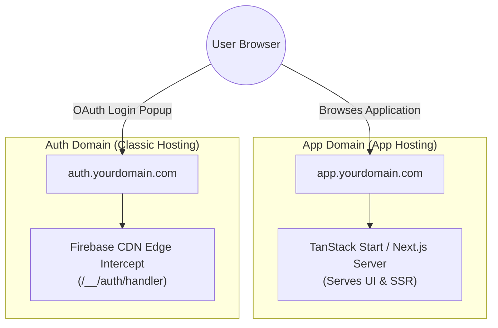

When implementing Firebase Authentication with OAuth providers (Google, Microsoft, Apple, Facebook, GitHub, etc.), users clicking the "Sign In" button are presented with a popup or redirect URL. By default, this popup displays the underlying Firebase domain:

`Continue to: https://<your-project-id>.firebaseapp.com`

For modern production applications, this breaks branding consistency and reduces user trust. Ideally, you want users to see your custom domain:

`Continue to: https://auth.yourdomain.com` (or `https://yourdomain.com`)

If you are using **Classic Firebase Hosting**, updating this is relatively straightforward. However, if you are deploying on **Firebase App Hosting** (the SSR-focused infrastructure powered by Cloud Run), you will quickly run into architectural limitations, `404 Not Found` errors on `/__/auth/handler`, and auto-injected configuration overrides.

In this guide, we will break down how Firebase App Hosting handles configuration injection and walk through the production-grade **Dedicated Auth Subdomain** pattern using Firebase App Hosting, Secret Manager, and modern SSR frameworks like TanStack Start, Next.js, or Angular.

---

## What is Firebase App Hosting & Why Is Overriding `FIREBASE_WEBAPP_CONFIG` Required?

### What is Firebase App Hosting?
Firebase App Hosting is Google's modern, framework-aware serverless hosting platform designed specifically for Fullstack and SSR web frameworks (Next.js, Angular, TanStack Start, Nuxt, etc.). Built on top of Google Cloud Run and Cloud Build, it automatically manages server-side rendering, build caching, secret management, and edge routing.

One of its key features is **[Automatic Web SDK Initialization](https://firebase.google.com/docs/app-hosting/firebase-sdks#automatically-initialize-firebase-admin-and-web-sdks)**. When your app builds and deploys, App Hosting automatically injects a reserved environment variable called `FIREBASE_WEBAPP_CONFIG` into your build and runtime environments. This enables zero-argument SDK initialization in your frontend code:

```typescript
import { initializeApp } from 'firebase/app';

// Automatically consumes FIREBASE_WEBAPP_CONFIG injected by App Hosting
const app = initializeApp();
```

### Why Do You Have to Override **[FIREBASE_WEBAPP_CONFIG](https://firebase.google.com/docs/app-hosting/firebase-sdks#javascript-sdk-override)**?
By default, the `FIREBASE_WEBAPP_CONFIG` JSON injected by Firebase App Hosting uses the default web app settings from your Firebase Console project. This default JSON looks like this:

```json
{
  "apiKey": "YOUR_API_KEY",
  "appId": "1:123456789012:web:abcdef1234567890",
  "authDomain": "<your-project-id>.firebaseapp.com",
  "messagingSenderId": "123456789012",
  "projectId": "<your-project-id>",
  "storageBucket": "<your-project-id>.firebasestorage.app"
}
```

Notice the `"authDomain"` key. The Firebase JavaScript SDK uses this value to build the OAuth popup target URL (`https://<authDomain>/__/auth/handler`). 

Even if you attach a custom domain (e.g., `app.yourdomain.com`) to your App Hosting backend, **App Hosting does not automatically rewrite the `authDomain` key inside `FIREBASE_WEBAPP_CONFIG`**. 

If you leave the default injected environment variable untouched, the SDK will continue to construct all OAuth popup and redirect requests pointing to `<your-project-id>.firebaseapp.com`. To tell the SDK to use your custom auth domain instead, you must explicitly override the injected `FIREBASE_WEBAPP_CONFIG` variable at build time.

---

## Understanding the Architectural Conflict

To understand why Firebase App Hosting throws a `404 Not Found` when pointing `authDomain` directly to your main app domain, we must look at how request routing differs between legacy and modern Firebase infrastructure.

### Classic Firebase Hosting (Edge Proxying)
Classic Firebase Hosting operates at Google's CDN edge. It has built-in, hidden routing rules. Whenever a request hits `/__/*` (such as `/__/auth/handler` or `/__/firebase/init.js`), the edge servers intercept the request **before** it hits your application and serve Google's internal OAuth handler scripts.

### Firebase App Hosting (Framework Control)
Firebase App Hosting delegates total routing control to your SSR framework (TanStack Start, Next.js, Remix, Angular, etc.). App Hosting does **not** intercept `/__/*` routes at the CDN level; it forwards all incoming traffic directly to your framework server.

Because your framework doesn't have an internal route or page mapped to `/__/auth/handler`, requesting that route through your primary App Hosting domain returns a **404 Not Found**.

---

## The Solution: The Dedicated Auth Subdomain Pattern

Because App Hosting cannot natively serve the `/__/*` reserved namespace on your primary app domain, the industry-standard architecture is to separate responsibilities:

1. **Main Application (`app.yourdomain.com`):** Runs on **Firebase App Hosting** to leverage SSR, server functions, and modern edge builds.
2. **Auth Gateway (`auth.yourdomain.com`):** Runs on **Classic Firebase Hosting** (a lightweight static site) solely to expose Google's hidden `/__/auth/handler` edge routing rules.



---

## Step 1: Securely Override `authDomain` in App Hosting

To override `FIREBASE_WEBAPP_CONFIG` without committing credentials or environment settings to Git, store the updated JSON in **Google Cloud Secret Manager**.

### 1. Create the Secret
Run the following command in your terminal using the Firebase CLI:

```bash
firebase apphosting:secrets:set CUSTOM_WEBAPP_CONFIG
```

When prompted, paste your updated web configuration JSON string pointing `authDomain` to your custom auth subdomain:

```json
{"apiKey":"YOUR_API_KEY","appId":"1:123456789012:web:abcdef1234567890","authDomain":"auth.yourdomain.com","messagingSenderId":"123456789012","projectId":"<your-project-id>","storageBucket":"<your-project-id>.firebasestorage.app"}
```

*(Select **Yes** when prompted to grant the App Hosting backend service account access to the secret).*

### 2. Update `apphosting.yaml`
Map the secret to the reserved `FIREBASE_WEBAPP_CONFIG` environment variable in your `apphosting.yaml`:

```yaml
env:
  - variable: FIREBASE_WEBAPP_CONFIG
    secret: CUSTOM_WEBAPP_CONFIG
    availability:
      - BUILD
```

### 3. Override the Admin SDK **[FIREBASE_CONFIG](https://firebase.google.com/docs/app-hosting/firebase-sdks#admin-sdk-override)** - Optional
If your server-side code uses the Firebase Admin SDK, App Hosting also automatically injects a FIREBASE_CONFIG variable.

To optionally specify custom initialization options for backend services such as Realtime Database, Cloud Storage, or Cloud Functions, use the FIREBASE_CONFIG environment variable. If the content of the FIREBASE_CONFIG variable begins with a `{` character it will be parsed as a JSON object. Otherwise the SDK assumes that the string is the path of a JSON file containing the options.

You can add this to your apphosting.yaml alongside the Web SDK override:

```yaml
env:
  # Web SDK Override via Secret
  - variable: FIREBASE_WEBAPP_CONFIG
    secret: CUSTOM_WEBAPP_CONFIG
    availability:
      - BUILD

  # Admin SDK Override via Value
  - variable: FIREBASE_CONFIG
    value: '{"credential": "applicationDefault()", "databaseURL": "https://<your-project-id>-default-rtdb.firebaseio.com"}'
    availability:
      - BUILD
      - RUNTIME
```
---

## Step 2: Implement Zero-Argument Initialization in Code

If your client code explicitly passes a configuration object to `initializeApp(firebaseConfig)` with hardcoded string fallbacks, it will ignore the injected `FIREBASE_WEBAPP_CONFIG` environment variable.

Update your Firebase initialization logic to prioritize zero-argument initialization in production, while maintaining explicit fallbacks for local development:

```typescript
"use client";

import { initializeApp, getApps } from "firebase/app";
import { getAuth } from "firebase/auth";
import { firebaseConfig } from "./config"; // Local dev fallback values

function createFirebaseApp() {
  // Prevent duplicate initialization during HMR / SSR
  if (getApps().length > 0) {
    return getApps()[0];
  }

  try {
    // 1. PRODUCTION (App Hosting)
    // Consumes FIREBASE_WEBAPP_CONFIG injected via Secret Manager
    return initializeApp();
  } catch (error) {
    // 2. LOCAL DEVELOPMENT
    // Fallback to explicit env vars or config objects
    return initializeApp(firebaseConfig);
  }
}

export const firebaseApp = createFirebaseApp();
export const auth = getAuth(firebaseApp);
```

> **Important Note for `pnpm` Users:** Zero-argument `initializeApp()` relies on a `postinstall` script inside the `firebase` package. `pnpm` disables postinstall scripts by default. Ensure your `package.json` includes:
> ```json
> {
>   "pnpm": {
>     "onlyBuiltDependencies": [
>       "firebase"
>     ]
>   }
> }
> ```

---

## Step 3: Provision the Dedicated Auth Subdomain on Classic Hosting

Next, map `auth.yourdomain.com` to Classic Firebase Hosting.

### Fixing the gRPC 501 `UNIMPLEMENTED` Error
When attempting to map a custom domain to a default Classic Hosting site on a project heavily using App Hosting, the GCP console may throw a `501 [12, "Operation is not implemented"]` error on the `ListCustomDomains` RPC endpoint.

To bypass this control-plane bug, create a fresh, secondary Classic Hosting site via the CLI:

```bash
# Create a dedicated secondary site
firebase hosting:sites:create <your-project-id>-auth
```

1. Navigate to **Firebase Console > Hosting**.
2. Locate the newly created `<your-project-id>-auth` site card.
3. Click **Add Custom Domain** and enter `auth.yourdomain.com`.
4. Follow the prompt to add the generated `A` and `TXT` records to your DNS provider.

---

## Step 4: Configure OAuth & Security Whitelists

For the authentication flow to succeed end-to-end, you must update two security lists across Firebase and Google Cloud Console.

### 1. Firebase Authorized Domains
Navigate to **Firebase Console > Authentication > Settings > Authorized Domains** and ensure **both** domains are present:

* `auth.yourdomain.com` (The OAuth handler host)
* `app.yourdomain.com` (The application host triggering the sign-in request)

> **Warning:** Do NOT remove your main application domain (`app.yourdomain.com`) from this list. The Firebase Web SDK verifies the origin domain before opening the popup. Removing it will trigger an `auth/unauthorized-domain` error.

### 2. Google Cloud Console OAuth 2.0 Client IDs
1. Open the [Google Cloud Console Credentials Page](https://console.cloud.google.com/apis/credentials).
2. Select your OAuth 2.0 Web Client ID.
3. Under **Authorized redirect URIs**, add exactly one URI:
   `https://auth.yourdomain.com/__/auth/handler`
4. Remove any previous `/__/auth/handler` URIs pointing directly to your App Hosting app domain (since App Hosting returns a 404 for this route).

---

## Step 5: Reusing the Auth Subdomain across Multiple App Backends

If you have multiple App Hosting backends in the same project (e.g., `app2.yourdomain.com`), you **do not** need to create multiple auth subdomains or add new OAuth Redirect URIs in Google Cloud Console.

`auth.yourdomain.com` can serve as the central authentication handler for all applications in your project:

1. Create a secret for the second backend (`NEXT_WEBAPP_CONFIG`) containing `"authDomain": "auth.yourdomain.com"`.
2. Add the second app's main domain (`app2.yourdomain.com`) to **Firebase Console > Authentication > Settings > Authorized Domains**.

---

## Summary Checklist

| Component | Responsibility / Value |
| :--- | :--- |
| **App Hosting Secret** | Injects `"authDomain": "auth.yourdomain.com"` into `FIREBASE_WEBAPP_CONFIG` at build time. |
| **Code Init Logic** | Uses zero-argument `initializeApp()` inside a `try/catch` block. |
| **Classic Hosting Site** | Hosts `auth.yourdomain.com` to serve internal `/__/auth/handler` OAuth scripts. |
| **GCP OAuth Redirect URIs** | Contains **only** `https://auth.yourdomain.com/__/auth/handler`. |
| **Firebase Authorized Domains** | Contains `auth.yourdomain.com` AND all app frontend domains (`app.yourdomain.com`, `app2.yourdomain.com`). |

By decoupling the OAuth handler route from your SSR framework and overriding `FIREBASE_WEBAPP_CONFIG` via Secret Manager, you maintain complete control over server-rendered builds on App Hosting while providing users with a seamless, fully-branded authentication experience.
