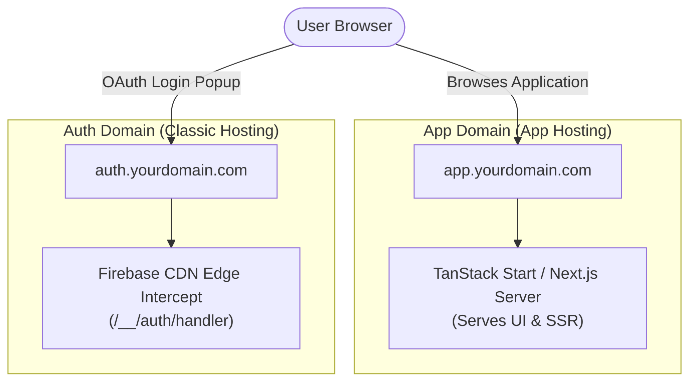

import Callout from '@/components/Callout.astro'

When users sign in through Firebase OAuth providers like Google, Apple, or GitHub, the consent popup defaults to Google's domain:

`Continue to: https://<your-project-id>.firebaseapp.com`

Seeing a generic `firebaseapp.com` subdomain instead of your own brand looks unfinished and degrades trust.

On Classic Firebase Hosting, pointing OAuth to your custom domain takes minutes. On Firebase App Hosting, it fails immediately. The Cloud Run SSR environment ignores Google's internal `/__/auth/handler` rewrite rules and returns a 404. Worse, App Hosting injects default project settings into the build environment, overwriting your client configuration.

Here is why that happens and how to resolve it by running a dedicated auth subdomain on Classic Hosting alongside your App Hosting backend.

---

## Why App Hosting requires overriding FIREBASE_WEBAPP_CONFIG

### How App Hosting manages environment config

App Hosting builds on Cloud Run and Cloud Build to run full-stack frameworks like Next.js, TanStack Start, and Angular.

During build and deployment, App Hosting automatically injects a reserved environment variable called `FIREBASE_WEBAPP_CONFIG`. This lets the Firebase Web SDK initialize without arguments in client code:

```typescript
import { initializeApp } from 'firebase/app';

// Consumes FIREBASE_WEBAPP_CONFIG injected by App Hosting
const app = initializeApp();
```

### The authDomain problem

The injected `FIREBASE_WEBAPP_CONFIG` JSON pulls values directly from your Firebase Console project settings:

```json
{
  "apiKey": "YOUR_API_KEY",
  "appId": "1:123456789012:web:abcdef1234567890",
  "authDomain": "<your-project-id>.firebaseapp.com",
  "messagingSenderId": "123456789012",
  "projectId": "<your-project-id>",
  "storageBucket": "<your-project-id>.firebasestorage.app"
}
```

The Firebase JavaScript SDK uses `authDomain` to build the OAuth popup and redirect target: `https://<authDomain>/__/auth/handler`.

Even if you connect a custom domain like `app.yourdomain.com` to App Hosting, App Hosting does not rewrite `authDomain` inside `FIREBASE_WEBAPP_CONFIG`. The SDK keeps opening `<your-project-id>.firebaseapp.com` unless you explicitly override `FIREBASE_WEBAPP_CONFIG` at build time.

---

## Why authDomain cannot point directly to App Hosting

The routing models between Classic Hosting and App Hosting differ fundamentally.

### Classic Firebase Hosting edge proxying

Classic Firebase Hosting runs behind Google's CDN edge. When a request hits reserved paths like `/__/auth/handler` or `/__/firebase/init.js`, edge servers intercept the request before reaching your application code and return Google's internal OAuth helper scripts.

### App Hosting routing

App Hosting forwards all incoming traffic directly to your server container. It does not intercept `/__/*` paths at the CDN level.

Because your SSR framework has no route handler registered for `/__/auth/handler`, any request sent to `https://app.yourdomain.com/__/auth/handler` returns a 404.

---

## Solution: The dedicated auth subdomain pattern

To work around this limitation, split the domains by role:

1. **Main application (`app.yourdomain.com`).** Runs on Firebase App Hosting to handle server-side rendering and API routes.
2. **Auth gateway (`auth.yourdomain.com`).** Runs on Classic Firebase Hosting as a blank static site, purely to expose Google's `/__/auth/handler` edge route.



---

## Step 1: Override authDomain in App Hosting

Store the replacement config in Google Cloud Secret Manager so you do not have to commit credentials or project details into source control.

### Create the secret

Run the secret creation command:

```bash
firebase apphosting:secrets:set CUSTOM_WEBAPP_CONFIG
```

When prompted, paste your configuration JSON with `authDomain` pointing to `auth.yourdomain.com`:

```json
{"apiKey":"YOUR_API_KEY","appId":"1:123456789012:web:abcdef1234567890","authDomain":"auth.yourdomain.com","messagingSenderId":"123456789012","projectId":"<your-project-id>","storageBucket":"<your-project-id>.firebasestorage.app"}
```

Grant the App Hosting service account read permissions for the secret when prompted.

### Update apphosting.yaml

Map the secret to `FIREBASE_WEBAPP_CONFIG` in `apphosting.yaml`:

```yaml
env:
  - variable: FIREBASE_WEBAPP_CONFIG
    secret: CUSTOM_WEBAPP_CONFIG
    availability:
      - BUILD
```

### Optional: Override Admin SDK config

If your server code uses the Firebase Admin SDK, App Hosting also injects a `FIREBASE_CONFIG` variable. You can supply custom initialization settings for database URLs or storage buckets directly:

```yaml
env:
  # Web SDK override via Secret Manager
  - variable: FIREBASE_WEBAPP_CONFIG
    secret: CUSTOM_WEBAPP_CONFIG
    availability:
      - BUILD

  # Admin SDK override via raw JSON string
  - variable: FIREBASE_CONFIG
    value: '{"credential": "applicationDefault()", "databaseURL": "https://<your-project-id>-default-rtdb.firebaseio.com"}'
    availability:
      - BUILD
      - RUNTIME
```

---

## Step 2: Initialize Firebase in application code

If client code passes a configuration object directly to `initializeApp(firebaseConfig)` with hardcoded fallbacks, it ignores the injected `FIREBASE_WEBAPP_CONFIG` variable.

Structure your initialization to use zero-argument initialization in production builds and explicit fallback objects for local development:

```typescript
"use client";

import { initializeApp, getApps } from "firebase/app";
import { getAuth } from "firebase/auth";
import { firebaseConfig } from "./config";

function createFirebaseApp() {
  if (getApps().length > 0) {
    return getApps()[0];
  }

  try {
    // Production (App Hosting)
    // Consumes FIREBASE_WEBAPP_CONFIG injected via Secret Manager
    return initializeApp();
  } catch (error) {
    // Local development
    // Falls back to explicit config values
    return initializeApp(firebaseConfig);
  }
}

export const firebaseApp = createFirebaseApp();
export const auth = getAuth(firebaseApp);
```

<Callout variant="important" title="pnpm postinstall requirement">
  Zero-argument `initializeApp()` depends on a `postinstall` script in the `firebase` package to generate SDK config. Because `pnpm` disables postinstall scripts by default, add `firebase` to `onlyBuiltDependencies` in `package.json`:
</Callout>

```json
{
  "pnpm": {
    "onlyBuiltDependencies": [
      "firebase"
    ]
  }
}
```

---

## Step 3: Set up the auth subdomain on Classic Hosting

### Fix gRPC 501 UNIMPLEMENTED errors

If you try to map a custom domain to the default Classic Hosting site on an App Hosting project, the Firebase Console often throws a `501 [12, "Operation is not implemented"]` error on `ListCustomDomains`.

To bypass this bug, create a new Classic Hosting site with the Firebase CLI:

```bash
# Create a dedicated secondary site
firebase hosting:sites:create <your-project-id>-auth
```

1. Open **Firebase Console > Hosting**.
2. Find the `<your-project-id>-auth` site card.
3. Click **Add Custom Domain** and enter `auth.yourdomain.com`.
4. Add the generated DNS `A` and `TXT` records in your DNS provider.

---

## Step 4: Update OAuth allowed domains

Both Firebase and Google Cloud Console require exact origin entries.

### 1. Firebase authorized domains

In **Firebase Console > Authentication > Settings > Authorized domains**, add both domains:

* `auth.yourdomain.com` (serves the OAuth handler)
* `app.yourdomain.com` (hosts the client app initiating login)

<Callout variant="warning" title="Keep application domain in authorized list">
  Keep your main domain (`app.yourdomain.com`) in this list. The SDK checks origin domains before opening auth popups. Removing it causes `auth/unauthorized-domain` errors.
</Callout>

### 2. Google Cloud Console redirect URIs

1. Open the [Google Cloud credentials page](https://console.cloud.google.com/apis/credentials).
2. Select your OAuth 2.0 Web Client ID.
3. Under **Authorized redirect URIs**, add:
   `https://auth.yourdomain.com/__/auth/handler`
4. Delete any old entries pointing to `app.yourdomain.com/__/auth/handler`.

---

## Step 5: Reuse the auth subdomain across apps

You do not need a separate auth subdomain for every frontend. A single `auth.yourdomain.com` handler can handle OAuth logins for multiple App Hosting backends in the same project:

1. Set the new backend's `FIREBASE_WEBAPP_CONFIG` secret to include `"authDomain": "auth.yourdomain.com"`.
2. Add the new app's domain (for example, `app2.yourdomain.com`) to **Firebase Console > Authentication > Settings > Authorized domains**.

---

## Summary checklist

| Component | Purpose |
| :--- | :--- |
| **App Hosting secret** | Injects `"authDomain": "auth.yourdomain.com"` into `FIREBASE_WEBAPP_CONFIG` at build time. |
| **Client initialization** | Calls `initializeApp()` with zero arguments in production. |
| **Classic Hosting site** | Serves `auth.yourdomain.com` to handle `/__/auth/handler` requests. |
| **GCP OAuth redirect URI** | Points to `https://auth.yourdomain.com/__/auth/handler`. |
| **Firebase authorized domains** | Lists `auth.yourdomain.com` and all application domains (`app.yourdomain.com`). |

Separating the OAuth handler from the SSR framework avoids the App Hosting 404 bug without giving up branded auth popups.
