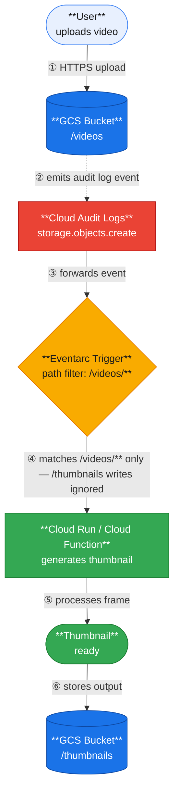

import Callout from '@/components/Callout.astro'

## Problem Statement

When building media processing pipelines on Google Cloud Storage (GCS), a common pattern is:
1. A user uploads a video file to `gs://bucket/videos/video.mp4`.
2. A Cloud Function (or Cloud Run service) is triggered to generate a preview thumbnail.
3. The thumbnail is saved back to `gs://bucket/thumbnails/video_thumbnail.png`.

At first glance, this is typically done using a standard **Cloud Storage "object finalized" trigger**. However, this naive approach introduces a critical **recursive execution loop**.

---

## Why Recursive Loops Happen

A typical GCS object finalized trigger configuration looks like this:

```yaml
type: google.cloud.storage.object.v1.finalized
bucket: my-media-bucket
```

This configuration triggers the destination function on **any** object created inside the bucket. 

1. When `videos/video.mp4` is uploaded: the function is triggered to run. ✅
2. The function generates the thumbnail and writes it to `thumbnails/video_thumbnail.png`.
3. Since the thumbnail is also a finalized object in the same bucket, it triggers the function again! ❌

This leads to:
* Duplicate and wasted executions.
* Unnecessary cloud compute costs.
* Excessive and confusing logging.
* Potential infinite loops that could spike your billing overnight.

<Callout variant="warning" title="Infinite Loop Risk">
  An infinite recursive loop can quickly consume your Google Cloud free tier credits or inflate your monthly billing. You should always safeguard against recursive triggers, either at the infrastructure level or inside the application code.
</Callout>

---

## Traditional Workaround (Code-Level Filtering)

Historically, developers solved this by checking the object path inside the application code and returning early:

```javascript
// Node.js example
if (objectName.startsWith("thumbnails/")) {
  console.log("Ignoring output thumbnail to prevent recursion.");
  return;
}
```

Or by verifying file extensions:

```javascript
if (!objectName.endsWith(".mp4")) {
  return;
}
```

### Limitations of this approach
While this prevents the function from executing its core logic repeatedly, it only **mitigates** the loop rather than resolving it:
* The function is still invoked and billed for the redundant event.
* Cold start latencies still impact resources.
* Extra log items are written.
* You pay for the execution time required to parse and discard the event.

---

## Better Solution: Eventarc Path Pattern Filtering via Cloud Audit Logs

A cleaner, production-grade approach is to use **Cloud Audit Logs** as the event source combined with **Eventarc path pattern filtering**. 

Instead of triggering on `google.cloud.storage.object.v1.finalized`, we trigger on `google.cloud.audit.log.v1.written` events filtered by path patterns. This allows us to target only events in `videos/` (e.g. `projects/_/buckets/my-media-bucket/objects/videos/*`). Thumbnail events written to `thumbnails/` are filtered out entirely at the Eventarc routing layer, so the function is never invoked.

---

## Architecture Overview



---

## Step-by-Step Implementation

### Step 1: Enable Cloud Storage Data Write Audit Logs
Before Eventarc can listen to audit events, you must enable Data Write logging for Cloud Storage:
1. Navigate to **IAM & Admin** → **Audit Logs** in the Google Cloud Console.
2. Search for and select **Google Cloud Storage** from the service list.
3. Check the **Data Write** log type checkbox.
4. Click **Save**.

### Step 2: Create the Eventarc Trigger (CLI)
Run the following `gcloud` command to spin up an Eventarc trigger pointing to your Cloud Run or Cloud Function service:

```shell
gcloud eventarc triggers create videos-folder-trigger \
  --location=${REGION} \
  --destination-run-service=thumbnail-service \
  --destination-run-region=${REGION} \
  --event-filters="type=google.cloud.audit.log.v1.written" \
  --event-filters="serviceName=storage.googleapis.com" \
  --event-filters="methodName=storage.objects.create" \
  --event-filters-path-pattern="resourceName=projects/_/buckets/bucket-name/objects/videos/*" \
  --service-account=YOUR_EVENTARC_SERVICE_ACCOUNT
```

### Step 3: Create the Trigger via Google Cloud Console
If you prefer the UI console:
1. Navigate to **Eventarc** → **Triggers** → **Create Trigger**.
2. Select **Cloud Audit Logs** as the event provider.
3. Select **Written** as the event type.
4. Set the Service to `storage.googleapis.com` and the Method to `storage.objects.create`.
5. Under the **Path Pattern** configuration, define the resource path:
   `resourceName = projects/_/buckets/bucket-name/objects/videos/*`
6. Select your target destination Cloud Run or Cloud Function.
7. Click **Create**.

---

## Minimal Debugging Function Example

Here is a minimal Node.js handler to verify that events are being received and routed correctly:

```javascript
const functions = require('@google-cloud/functions-framework');

functions.cloudEvent('thumbnailTrigger', (event) => {
  const payload = event.data?.protoPayload || {};

  console.log("Event ID:", event.id);
  console.log("Method Name:", payload.methodName);
  console.log("Resource Name:", payload.resourceName);
});
```

---

## Supporting Multiple Video Formats

Using a path pattern filter like `objects/videos/*` routes all files in that folder. To process only specific file formats (e.g. `.mp4`, `.mkv`, `.mov`), perform light filtering in the function's entry point:

```javascript
const allowedExtensions = ['.mp4', '.mkv', '.mov', '.webm'];
const objectName = payload.resourceName;

if (!allowedExtensions.some(ext => objectName.toLowerCase().endsWith(ext))) {
  console.log(`Ignoring unsupported file: ${objectName}`);
  return;
}
```

---

## Comparison: Storage Finalized vs. Audit Log Path Filtering

| Feature | Storage Finalized Trigger | Audit Log Path Filter Trigger |
| :--- | :---: | :---: |
| **Bucket-Level Filtering** | Yes | Yes |
| **Folder-Level Filtering** | No | Yes |
| **Code-Level Complexity** | High (must handle early exits) | Low (routed correctly by Eventarc) |
| **Duplicate Invocation Cost** | High (double-billed for ignore-checks) | None (redundant events are filtered) |
| **Recursive Loop Risk** | High | None |
| **Production Recommendation** | Dev / Test only | **Recommended** |

---

## Cost Considerations

* **Cloud Audit Logs Pricing**: GCS Data Write audit logs are billed under Cloud Logging. However, Google Cloud provides **50 GB of free logging storage** per month per project.
* **Event Size**: A typical storage creation audit log event size is between **1 KB and 3 KB**.
* **Workload Example**: For a pipeline processing **10,000 uploads** per month, the logs generated will consume under **30 MB**, which easily fits within the free tier.

---

## Production Best Practices

* **Use Directory Placeholders Exclusion**: When creating folders in the GCS Console, Google creates zero-byte directory placeholders ending in a slash (e.g. `videos/`). Exclude these at the top of your function:
  ```javascript
  if (objectName.endsWith('/')) return;
  ```
* **Enable Event Retries Carefully**: Eventarc triggers support retry-on-failure. Enable this only if your function logic is fully idempotent (meaning running it twice on the same file does not cause errors).
