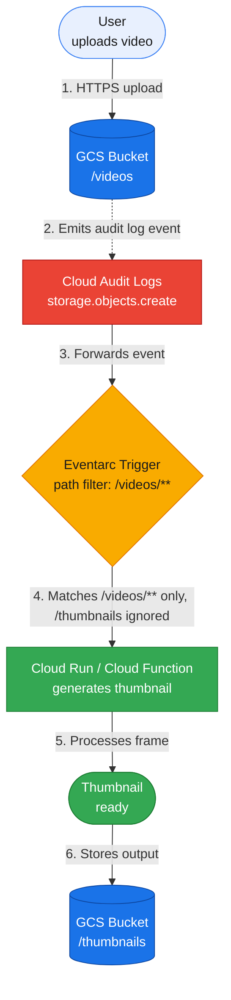

import Callout from '@/components/Callout.astro'

## The problem with default storage triggers

A standard file processing workflow on Google Cloud Storage looks like this:

1. An upload arrives at `gs://bucket/videos/video.mp4`.
2. A Cloud Function or Cloud Run service generates a preview image.
3. The function writes the image back to `gs://bucket/thumbnails/video_thumbnail.png`.

Wiring this workflow up with a standard `google.cloud.storage.object.v1.finalized` trigger creates an immediate loop.

---

## Why default GCS triggers loop

The default finalized trigger fires on every object creation in the bucket:

```yaml
type: google.cloud.storage.object.v1.finalized
bucket: my-media-bucket
```

When `videos/video.mp4` lands in the bucket, the function runs and writes `thumbnails/video_thumbnail.png`. Because that thumbnail is also a new object in the same bucket, GCS fires another finalized event. The function runs again, generating another file or looping until memory or concurrency limits cut it off.

Without safeguards, a single upload can trigger hundreds of billable function invocations in minutes.

<Callout variant="warning" title="Infinite loop risk">
  Unfiltered recursive triggers can burn through Cloud Functions quotas and run up unexpected billing charges within hours.
</Callout>

---

## The code-level workaround and why it falls short

The common workaround is checking the object path in code and returning early:

```javascript
if (objectName.startsWith('thumbnails/')) {
  return;
}
```

Or filtering by extension:

```javascript
if (!objectName.endsWith('.mp4')) {
  return;
}
```

Early returns prevent the heavy processing logic from running, but the function still spins up. You pay for the invocation, cold starts still burn compute resources, and logs fill with ignored events.

---

## Filter by path pattern using Cloud Audit Logs and Eventarc

A better solution is to route events through Cloud Audit Logs and Eventarc path patterns.

Instead of listening for `google.cloud.storage.object.v1.finalized`, create an Eventarc trigger for `google.cloud.audit.log.v1.written` events with a resource path pattern targeting `objects/videos/*`. When the function writes to `thumbnails/`, Eventarc drops the event before invoking your function.

---

## Architecture



---

## Setup

### 1. Enable Cloud Storage Data Write audit logs

Before Eventarc can listen to audit events, enable Data Write logging for Cloud Storage:

1. Open **IAM & Admin > Audit Logs** in Google Cloud Console.
2. Select **Google Cloud Storage** from the service list.
3. Check the **Data Write** log type checkbox.
4. Click **Save**.

### 2. Create the Eventarc trigger using gcloud

Run the `gcloud` command to create an Eventarc trigger pointing to your Cloud Run or Cloud Function service:

```shell
gcloud eventarc triggers create videos-folder-trigger \
  --location=${REGION} \
  --destination-run-service=thumbnail-service \
  --destination-run-region=${REGION} \
  --event-filters="type=google.cloud.audit.log.v1.written" \
  --event-filters="serviceName=storage.googleapis.com" \
  --event-filters="methodName=storage.objects.create" \
  --event-filters-path-pattern="resourceName=projects/_/buckets/bucket-name/objects/videos/*" \
  --service-account=YOUR_EVENTARC_SERVICE_ACCOUNT
```

### 3. Create the trigger in Google Cloud Console

If you prefer the web console:

1. Open **Eventarc > Triggers > Create Trigger**.
2. Select **Cloud Audit Logs** as the event provider.
3. Select **Written** as the event type.
4. Set the Service to `storage.googleapis.com` and the Method to `storage.objects.create`.
5. Under **Path Pattern**, enter:
   `resourceName = projects/_/buckets/bucket-name/objects/videos/*`
6. Select your destination Cloud Run or Cloud Function service.
7. Click **Create**.

---

## Test function handler

A minimal Node.js handler to verify that events arrive with the expected payload:

```javascript
const functions = require('@google-cloud/functions-framework');

functions.cloudEvent('thumbnailTrigger', (event) => {
  const payload = event.data?.protoPayload || {};

  console.log('Event ID:', event.id);
  console.log('Method Name:', payload.methodName);
  console.log('Resource Name:', payload.resourceName);
});
```

---

## Handle specific file extensions

The path pattern filter `objects/videos/*` routes every file in the folder. To process only specific video extensions (like `.mp4` or `.mov`), filter at the top of your function:

```javascript
const allowedExtensions = ['.mp4', '.mkv', '.mov', '.webm'];
const objectName = payload.resourceName;

if (!allowedExtensions.some(ext => objectName.toLowerCase().endsWith(ext))) {
  console.log(`Ignoring unsupported file: ${objectName}`);
  return;
}
```

---

## Trigger comparison

| Feature | Storage finalized trigger | Audit log path pattern trigger |
| :--- | :---: | :---: |
| Bucket-level filtering | Yes | Yes |
| Folder-level filtering | No | Yes |
| Application-level filtering required | Yes | No |
| Redundant invocations | Yes | None |
| Recursive loop risk | High | None |

---

## Cost and log volume

* GCS Data Write audit logs count against Cloud Logging storage. Google Cloud includes 50 GiB of free logging per project each month.
* A typical object creation audit entry is between 1 KiB and 3 KiB.
* At 10,000 uploads per month, the audit trail generates under 30 MiB of logs, well inside the free allocation.

---

## Implementation details to watch for

* **Ignore directory placeholder objects.** Creating folders in the Cloud Storage console writes zero-byte objects ending with a trailing slash (`videos/`). Add `if (objectName.endsWith('/')) return;` at the start of your handler.
* **Idempotency before retries.** Eventarc supports automatic retries on failure. Only enable retries if your processing pipeline handles duplicate executions cleanly.
