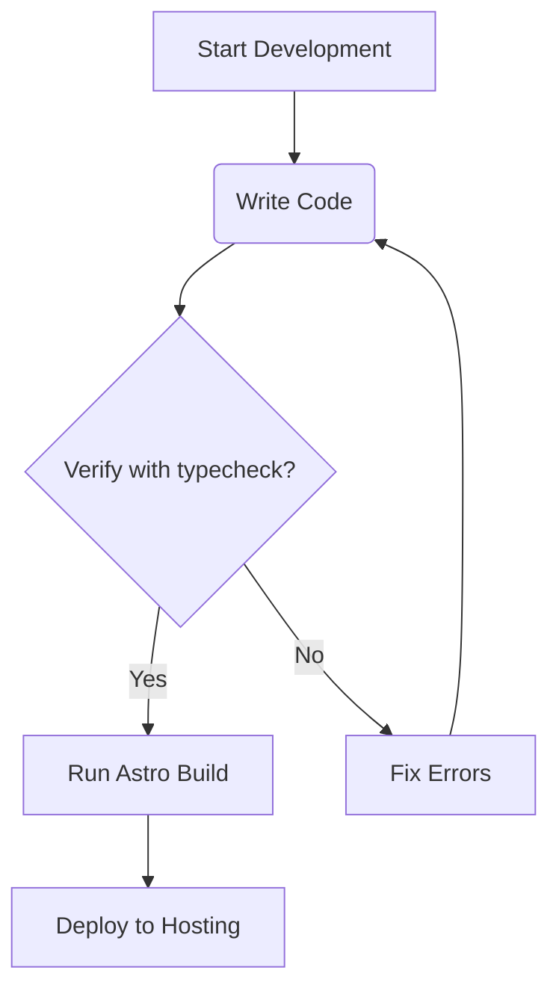

# Welcome

This is a live demo of MDXEditor with all default features on.

> The overriding design goal for Markdown's formatting syntax is to make it as readable as possible.
> The idea is that a Markdown-formatted document should be publishable as-is, as plain text,
> without looking like it's been marked up with tags or formatting instructions.
>
> [Daring Fireball](https://daringfireball.net/projects/markdown/)

Supported markdown elements:

* Headings
* Lists
  * Unordered
  * Ordered
  * Check lists
  * Nested
* Links
* Bold, italic, and underline formatting
* Tables
* Code block editors
* Math and diagrams

The editor content is styled using the `@tailwindcss/typography` [plugin](https://tailwindcss.com/docs/typography-plugin).

## Test editor features

Use this space to test markdown rendering and editing behavior. Switch to source mode using the toggle in the top right, paste markdown content, and toggle back to rich text mode.

Things you can try:

1. Add your own code sample
2. Change heading levels
3. Insert a table and add rows or columns
4. Switch to raw markdown source to inspect output
5. Test the diff feature to see changes
6. Add frontmatter properties

## Code sample

MDXEditor embeds CodeMirror for code editing:

```tsx
export default function App() {
  return (<div>Hello world</div>)
}
```

## Live component example

The block below is a live React component. You can configure multiple live code presets that specify available npm packages and default imports:

```jsx title="src/App.tsx" caption="Styling code blocks using rehype-pretty-code (with a caption down here)" showLineNumbers {10-12} /apply/ /components/
export default function App() {
  return (
    <div>
      <p>This is a React JSX in action</p>
    </div>
  )
}
```

## Tables and math

Play with the table below: add rows, columns, and change column alignment. Navigate cells with `Enter`, `Shift+Enter`, `Tab`, and `Shift+Tab`.

| Item              | In Stock | Price |
| :---------------- | :------: | ----: |
| Python Hat        |   True   | 23.99 |
| SQL Hat           |   True   | 23.99 |
| Codecademy Tee    |   False  | 19.99 |
| Codecademy Hoodie |   False  | 42.99 |

LaTeX is supported with [KaTeX](https://katex.org/):

> To solve the cubic equation $t^3 + pt + q = 0$ (where the real numbers
> $p, q$ satisfy $4p^3 + 27q^2 > 0$) one can use Cardano's formula:
>
> $$
>   \sqrt[3]{
>     -\frac{q}{2}
>     +\sqrt{\frac{q^2}{4} + \frac{p^{3}}{27}}
>   }+
>   \sqrt[3]{
>     -\frac{q}{2}
>     -\sqrt{\frac{q^2}{4} + \frac{p^{3}}{27}}
>   }
> $$
>
> For any $u_1, \dots, u_n \in \mathbb{C}$ and
> $v_1, \dots, v_n \in \mathbb{C}$, the Cauchy-Bunyakovsky-Schwarz
> inequality can be written as follows:
>
> $$
>   \left| \sum_{k=1}^n {u_k \bar{v_k}} \right|^2
>   \leq
>   {
>     \left( \sum_{k=1}^n {|u_k|} \right)^2
>     \left( \sum_{k=1}^n {|v_k|} \right)^2
>   }
> $$
>
> Finally, the determinant of a Vandermonde matrix can be calculated
> using the following expression:
>
> $$
>   \begin{vmatrix}
>   1 & x_1 & x_1^2 & \dots & x_1^{n-1} \\
>   1 & x_2 & x_2^2 & \dots & x_2^{n-1} \\
>   1 & x_3 & x_3^2 & \dots & x_3^{n-1} \\
>   \vdots & \vdots & \vdots & \ddots & \vdots \\
>   1 & x_n & x_n^2 & \dots & x_n^{n-1} \\
>   \end{vmatrix}
>   = {\prod_{1 \leq {i,j} \leq n} {(x_i - x_j)}}
> $$
>
> <cite>[Three famous mathematical formulas](https://developer.mozilla.org/en-US/docs/Learn/MathML/First_steps/Three_famous_mathematical_formulas) on MDN</cite>

## Mermaid diagrams

Here is a test of Mermaid diagram support:



## GitHub-style callouts

Here are tests for GitHub-style blockquote alerts:

> [!NOTE]
> This is a useful note detailing background context or general information.

> [!TIP]
> This is a helpful tip or optimization suggestion for improved performance.

> [!IMPORTANT]
> This represents essential requirements or key steps critical for completion.

> [!WARNING]
> This warning alerts you to potential breaking changes or security issues.

> [!CAUTION]
> This caution represents high-risk actions that could cause data loss or bugs.

## Emojis and task lists

Test emojis and checkboxes:

* :tada: Emojis are enabled.
* :rocket: Fast loading times.
- [x] Check icon maps updated
- [x] Tested devicon integration
- [ ] Deploy production build

## Syntax highlighting with Expressive Code

This code block demonstrates line highlighting, focus states, and collapsible sections:

```typescript title="src/lib/demo.ts" {1, 5-7} collapse={9-12}
// Highlight lines 1 and 5-7
import { getTechIconClass } from '@/lib/tech-icons';

export function demonstrateIcons() {
  const reactIcon = getTechIconClass('react');
  const tailwindIcon = getTechIconClass('tailwind');
  const gcpIcon = getTechIconClass('gcp');

  // This section is collapsed by default
  console.log('React icon class:', reactIcon);
  console.log('Tailwind icon class:', tailwindIcon);
  console.log('GCP icon class:', gcpIcon);

  return { reactIcon, tailwindIcon, gcpIcon };
}
```

## HTML details element

<details>
  <summary>Click to expand and reveal hidden content</summary>

  This is inside the details element. Markdown elements like **bold text** and `code inline` should be styled correctly here.
</details>
