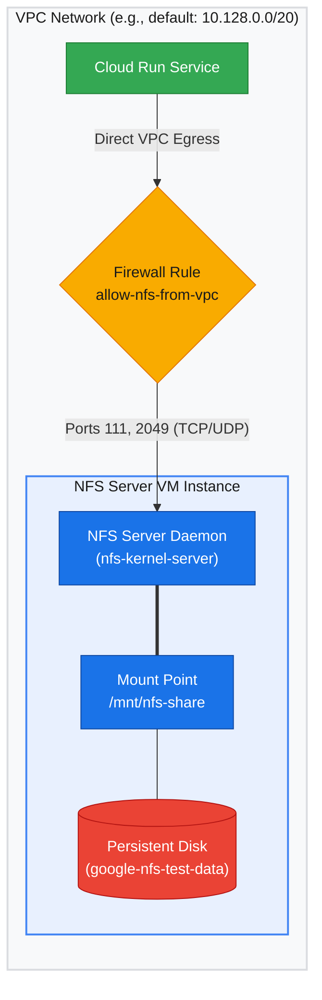

Sharing persistent files across container instances is a frequent requirement on Cloud Run and Google Kubernetes Engine. Google Cloud's managed solution, Filestore, starts at 1 TiB on the Basic tier. At roughly $160 per month, that minimum allocation is expensive for small workloads, development environments, and side projects.

You can run a lightweight Linux NFS server on a Compute Engine `e2-micro` instance with a standard 10 GB persistent disk for under $5 a month. Here is how to set up the VM, configure NFS exports, and mount the share inside Cloud Run using Direct VPC egress.

---

## Architecture

The NFS server VM lives in the same VPC network as the Cloud Run service. Firewall rules restrict NFS traffic so only clients inside the internal subnet can connect.



---

## 1. Create the VM and persistent disk

Putting the shared data on a separate persistent disk decouples storage from the VM instance. If the VM needs to be rebuilt, resized, or replaced, the data disk remains untouched.

### Create the VM

1. Open **Compute Engine > VM instances** in Google Cloud Console.
2. Click **Create Instance**.
3. Configure the VM:
   * Name: `nfs-server-vm`
   * Region and zone: Match your Cloud Run service region (for example, `us-central1` and `us-central1-a`).
   * Machine type: `e2-micro` (2 vCPUs, 1 GB memory) works well for test environments and light workloads.
   * Boot disk: Ubuntu 22.04 LTS.
4. Under **Networking > Network interfaces**:
   * Note the VPC network and subnet (for example, `default` with CIDR `10.128.0.0/20`).
   * Note the internal IP address (for example, `10.128.0.3`).
   * Add the network tag `nfs-server`.

### Create the persistent disk

1. Open **Compute Engine > Storage > Disks**.
2. Click **Create Disk**.
3. Set the disk parameters:
   * Name: `nfs-test-data`
   * Disk type: Standard persistent disk (or Balanced persistent disk for higher IOPS)
   * Size: 10 GB
   * Zone: Must match the VM zone (`us-central1-a`)
4. Click **Create**.

### Attach the disk to the VM

1. Open `nfs-server-vm` in the console.
2. Click **Edit**.
3. Under **Additional disks**, click **Attach existing disk** and select `nfs-test-data`.
4. Click **Save**.

---

## 2. Configure firewall rules

The NFS server must accept internal traffic on port 111 (RPC binder) and port 2049 (NFS).

1. Open **VPC network > Firewall**.
2. Click **Create Firewall Rule**.
3. Set the rule parameters:
   * Name: `allow-nfs-from-vpc`
   * Network: `default`
   * Direction: Ingress
   * Action: Allow
   * Target tags: `nfs-server`
   * Source filter: IPv4 ranges
   * Source IPv4 ranges: Enter your subnet CIDR (for example, `10.128.0.0/20`)
   * Protocols and ports: TCP `111, 2049` and UDP `111, 2049`
4. Click **Create**.

---

## 3. Set up the NFS server on the VM

Connect to the VM using SSH to format the persistent disk, mount it, and start the NFS daemon:

```bash
gcloud compute ssh nfs-server-vm --zone=us-central1-a
```

### Install packages

```bash
sudo apt-get update
sudo apt-get install -y nfs-kernel-server
```

### Format the attached disk

Compute Engine exposes attached disks under `/dev/disk/by-id/`:

```bash
# Check the disk device path
ls /dev/disk/by-id/

# Format the persistent disk as ext4 (run only once)
sudo mkfs.ext4 -F /dev/disk/by-id/google-nfs-test-data
```

<Callout variant="warning" title="Data loss warning">
  Formatting with `mkfs.ext4` deletes all existing data on the device. Verify you have targeted the correct device ID before executing.
</Callout>

### Mount the disk and persist reboots

Mount the formatted disk and record its UUID in `/etc/fstab`:

```bash
# Create mount directory
sudo mkdir -p /mnt/nfs-share

# Mount the disk
sudo mount /dev/disk/by-id/google-nfs-test-data /mnt/nfs-share

# Get the UUID and persist in fstab
UUID=$(sudo blkid /dev/disk/by-id/google-nfs-test-data -s UUID -o value)
echo "UUID=$UUID /mnt/nfs-share ext4 defaults 0 0" | sudo tee -a /etc/fstab
```

### Configure export permissions

Set permissions and define which CIDR blocks can mount the directory:

```bash
# Set folder permissions
sudo chmod 777 /mnt/nfs-share

# Add export rule (replace 10.128.0.0/20 with your VPC subnet CIDR)
echo "/mnt/nfs-share 10.128.0.0/20(rw,sync,no_subtree_check,no_root_squash)" | sudo tee /etc/exports
```

### NFS export options explained

* `rw`. Grants read and write permissions to clients.
* `sync`. Flushes writes to disk before responding, protecting against data corruption during unexpected restarts.
* `no_subtree_check`. Prevents subtree verification on subdirectories, improving reliability when clients rename files.
* `no_root_squash`. Allows client root users to access files as root on the server. Containerized workloads like Cloud Run or Kubernetes pods running as root require this flag.

### Start the NFS service

```bash
sudo exportfs -a
sudo systemctl restart nfs-server
```

### Test mount locally

Verify the export by mounting it to a temporary local path:

```bash
sudo mkdir -p /tmp/nfs-test
sudo mount -t nfs 10.128.0.3:/mnt/nfs-share /tmp/nfs-test
df -h
sudo umount /tmp/nfs-test
```

---

## 4. Mount the share in Cloud Run

### Configure VPC egress

To reach the VM internal IP, Cloud Run needs VPC connectivity:

1. Under Cloud Run network settings, enable Direct VPC egress rather than a Serverless VPC connector. Direct VPC egress has lower latency and avoids connector provisioning fees.
2. Route private IP ranges (RFC 1918) through your VPC.

### Add the NFS volume mount

Add the volume in your Cloud Run service configuration:

* Volume type: Network File System (NFS)
* Server: `10.128.0.3` (your VM internal IP)
* Path: `/mnt/nfs-share`
* Mount path: `/mnt/data` (the directory path inside the container)

<Callout variant="note" title="Google documentation">
  For command-line flags and Cloud Run YAML specifications, refer to the [Google Cloud documentation on Cloud Run NFS volume mounts](https://docs.cloud.google.com/run/docs/configuring/services/nfs-volume-mounts#mount-volume).
</Callout>

---

## Production considerations

Running NFS on Compute Engine gives you fine-grained control over cost and disk sizing without Filestore minimums. For production deployments:

* **Automate disk snapshots.** Schedule daily snapshots for `nfs-test-data` in Compute Engine to guard against accidental deletion or filesystem corruption.
* **Use a static internal IP.** Assign a static internal IP address to `nfs-server-vm` so reboots or IP churn do not break client mounts.
* **Narrow firewall rules.** Limit the ingress firewall rule to the exact subnet used by Cloud Run Direct VPC egress instead of the entire VPC.
* **Monitor disk IOPS.** Standard persistent disks throttle IOPS based on provisioned capacity. If file access feels sluggish under load, upgrade the disk type to Balanced or SSD without changing the VM.
