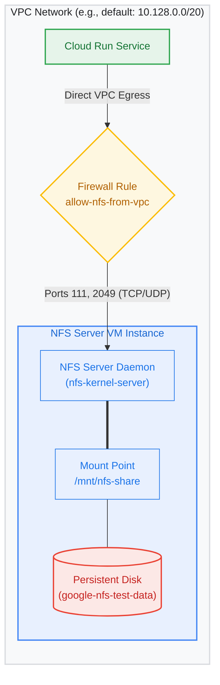

When building serverless or containerized applications (such as on **Cloud Run** or **Google Kubernetes Engine**), sharing persistent file storage between multiple container instances is a common requirement. The standard solution in Google Cloud is **Filestore**—a fully managed NFS service. 

However, Filestore has a minimum capacity requirement of 1 TB for the Basic tier, which can be cost-prohibitive for dev/test environments, micro-workloads, or personal projects.

A highly flexible and cost-effective alternative is hosting your own **Network File System (NFS) Server on Google Compute Engine (GCE)** backed by a standard persistent disk. This guide walks you through setting up a self-hosted NFS server and connecting it to Cloud Run.

---

## Architecture Overview

Here is the topology of the system. The NFS server VM runs in the same VPC network as the Cloud Run service, and traffic is restricted securely using firewall rules.



---

## 1. Create the GCE VM and Disk

First, we create the virtual machine and the separate persistent disk that will host the NFS data. Placing the data on a separate persistent disk is best practice, as it decouples the state (the storage) from the compute instance (the VM).

### Step A: Create the VM
1. Go to the **Compute Engine -> VM instances** page in the Google Cloud Console.
2. Click **Create Instance**.
3. Configure the following:
   * **Name:** `nfs-server-vm`
   * **Region/Zone:** Choose your preferred region and zone (e.g., `us-central1` and `us-central1-a`).
   * **Machine Type:** A small instance like `e2-micro` (2 vCPUs, 1 GB RAM) is perfectly fine for light/medium NFS workloads and testing.
   * **Boot Disk:** Select **Ubuntu 22.04 LTS** (to match the configuration commands below).
4. Under **Networking -> Network Interfaces**:
   * Note down the **VPC network** and **subnet** (e.g., `default`, `10.128.0.0/20`). You will need this IP range for security configs.
   * Take note of the VM's **Internal IP** (e.g., `10.128.0.3`). This is the target address your clients will use.
   * Add a network tag: `nfs-server`.

### Step B: Create the Data Disk
1. Go to **Compute Engine -> Storage -> Disks**.
2. Click **Create Disk**.
3. Configure the following:
   * **Name:** `nfs-test-data`
   * **Type:** Standard persistent disk (or Balanced/SSD if you need faster I/O).
   * **Size:** 10 GB (or whatever size fits your storage budget).
   * **Zone:** **Must be in the same zone** as your VM (e.g., `us-central1-a`).
4. Click **Create**.

### Step C: Attach the Disk to the VM
1. Go back to your VM instances list and click on `nfs-server-vm`.
2. Click **Edit**.
3. Under **Additional disks**, click **Attach existing disk**.
4. Select `nfs-test-data` from the dropdown list.
5. Click **Save**. The disk is now attached to the VM instance.

---

## 2. Configure Firewall Rules

For security, the NFS server should only accept connection requests from sources inside your internal network (VPC). We need to open ports **111** (RPC binder service) and **2049** (NFS server port) for internal traffic.

1. Go to **VPC network -> Firewall**.
2. Click **Create Firewall Rule**.
3. Configure the rule:
   * **Name:** `allow-nfs-from-vpc`
   * **Network:** Select your VPC (e.g., `default`).
   * **Direction of traffic:** Ingress
   * **Action on match:** Allow
   * **Targets:** Specified target tags
   * **Target tags:** `nfs-server` (this matches the tag we assigned to the VM)
   * **Source filter:** IPv4 ranges
   * **Source IPv4 ranges:** Enter your VPC's internal subnet range (e.g., `10.128.0.0/20` or `10.0.0.0/8`).
   * **Protocols and ports:**
     * Check **tcp** and enter `111, 2049`.
     * Check **udp** and enter `111, 2049`.
4. Click **Create**.

---

## 3. SSH into VM and Setup NFS Server

Now, connect to the VM using the GCP console or the `gcloud` CLI to format the persistent disk, mount it, and start the NFS daemon.

```bash
# SSH into your VM using gcloud
gcloud compute ssh nfs-server-vm --zone=us-central1-a
```

### Commands in the VM SSH Terminal

#### 1. Update Package Lists & Install NFS Server
```bash
# Update local packages database
sudo apt-get update

# Install the standard Linux NFS kernel server package
sudo apt-get install -y nfs-kernel-server
```

#### 2. Find and Format the Attached Disk
GCE attaches persistent disks with standard symlinks under `/dev/disk/by-id/`.
```bash
# Navigate to the disk by-id directory
cd /dev/disk/by-id/

# List the devices. Your disk will appear prefixed with 'google-' 
# in this case: 'google-nfs-test-data'
ls 

# Go back to your home directory
cd

# Format the persistent disk as ext4.
# WARNING: Only format the disk once! The -F flag forces it.
sudo mkfs.ext4 -F /dev/disk/by-id/google-nfs-test-data
```

#### 3. Mount the Disk and Persist Reboots
We mount the disk to a clean directory. To ensure the disk stays mounted when the VM restarts, we'll append a configuration entry to `/etc/fstab`.
```bash
# Create the target sharing directory
sudo mkdir -p /mnt/nfs-share

# Mount the newly formatted disk to the directory
sudo mount /dev/disk/by-id/google-nfs-test-data /mnt/nfs-share

# Get the unique UUID of our disk to use inside fstab
UUID=$(sudo blkid /dev/disk/by-id/google-nfs-test-data -s UUID -o value)

# Append to /etc/fstab for mount persistence across reboots
echo "UUID=$UUID /mnt/nfs-share ext4 defaults 0 0" | sudo tee -a /etc/fstab
```

#### 4. Configure Share Permissions & NFS Exports
Now, define the directory accessibility.
```bash
# Provide open read/write permissions on the mount point.
# Note: For production use cases, implement restrictive ownership patterns.
sudo chmod 777 /mnt/nfs-share
```

Next, configure the exports file `/etc/exports` which defines which CIDR blocks can mount this directory:
```bash
# Add export rule. Adjust the IP range '10.128.0.0/20' to match your VPC network.
echo "/mnt/nfs-share 10.128.0.0/20(rw,sync,no_subtree_check,no_root_squash)" | sudo tee /etc/exports 
```

> **What do these configuration options mean?**
> - **`rw`**: Grants read and write permission to the client.
> - **`sync`**: Forces the server to reply to requests only after changes have been committed to stable storage. This prevents data corruption.
> - **`no_subtree_check`**: Disables subtree checking. This improves performance and prevents issues when files are renamed within the mounted directory.
> - **`no_root_squash`**: By default, NFS maps root client requests to an unprivileged user (`nobody`). Setting `no_root_squash` allows the client root user to preserve root access on the NFS server. This is typically required by containerized systems (like Cloud Run or Kubernetes pods running as root).

#### 5. Apply Configurations & Start Service
```bash
# Re-export all directories defined in /etc/exports
sudo exportfs -a

# Restart the NFS service daemon to apply the change
sudo systemctl restart nfs-server
```

#### 6. (Optional) Verify the Mount Locally
To confirm the NFS daemon is sharing properly, mount it locally to a temporary folder:
```bash
# Create local temp test mount directory
sudo mkdir -p /tmp/nfs-test

# Mount it from the internal IP (replace 10.128.0.3 with your VM's actual internal IP)
sudo mount -t nfs 10.128.0.3:/mnt/nfs-share /tmp/nfs-test

# Check disk space to confirm mount success
df -h
# You should see the disk mounted at both /mnt/nfs-share and /tmp/nfs-test!

# Clean up/unmount the test directory
sudo umount /tmp/nfs-test
```

---

## 4. Mount the NFS Share in Cloud Run

With your NFS server running internally, you can attach it to a Cloud Run service as a volume mount.

1. **Connect Cloud Run to your VPC:**
   Cloud Run services run in a sandboxed environment. To access the GCE VM's internal IP, you must configure network egress.
   * Attach your Cloud Run service to your VPC network.
   * **Tip:** For best performance and lower costs, use **Direct VPC Egress** rather than Serverless VPC Access Connectors.
   * Route **all traffic** (or only private/RFC 1918 traffic) through the VPC.

2. **Mount the volume:**
   Define the volume in your Cloud Run service definition (using Console or YAML):
   * **Volume Type:** Network File System (NFS)
   * **Path:** `/mnt/nfs-share` (the path exported in `/etc/exports` on your VM)
   * **Server:** `10.128.0.3` (your VM's internal IP address)
   * **Mount Path:** Locate where you want it mapped inside your container (e.g., `/mnt/data`).

For detailed step-by-step CLI commands and Console instructions on mounting, refer to the [Google Cloud Cloud Run NFS Volume Mounts documentation](https://docs.cloud.google.com/run/docs/configuring/services/nfs-volume-mounts#mount-volume).

---

## Summary & Best Practices

Using a self-hosted NFS server on GCE is a highly effective way to achieve shared persistent storage without the high baseline cost of fully managed storage products. 

When deploying to production, keep these operational tips in mind:
* **Backup Disks:** Set up scheduled snapshots for your GCE persistent disk (`nfs-test-data`) to protect against data loss.
* **VM Sizing:** Start small. Monitor CPU and Network bandwidth usage on the `nfs-server-vm` and scale machine types as demands increase.
* **IP Preservation:** Ensure your NFS GCE instance uses a **static internal IP address** so that client mounts do not break if the VM is rebooted or recreated.
* **Restrict Rules:** Fine-tune your firewall ingress rule to allow traffic only from the exact subnets that host your clients (like the specific Direct VPC subnet assigned to Cloud Run).
